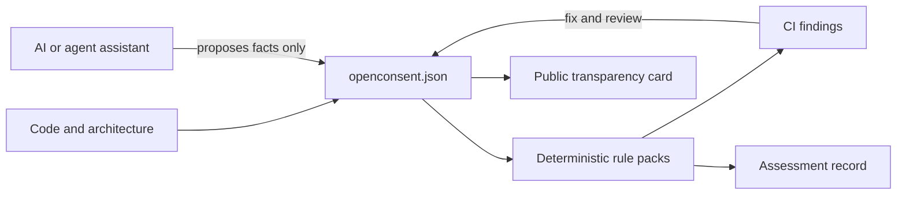

# openConsent

**Open compliance infrastructure for software created by people, AI, and agents.**

openConsent is an open, developer-first policy and evidence layer for projects built with or powered by AI. It turns privacy assumptions into a versioned project manifest, checks that manifest against transparent rule packs, and produces a public transparency card and an unsigned, reproducible assessment record.

**Official website:** [noir-hedgehog.github.io/openConsent](https://noir-hedgehog.github.io/openConsent/)

The first rule packs focus on GDPR readiness and CCPA/CPRA readiness. They are selectable because applicability depends on the project, organisation, users, and processing activity.

> openConsent is compliance engineering infrastructure, not a law firm, legal opinion, certification, or guarantee of compliance. It finds missing declarations and evidence; qualified people remain responsible for applicability and legal conclusions.

## Why this exists

AI can create an application before its data flows, vendors, retention periods, and user controls have been made explicit. Agentic systems add a second problem: software can start calling models and tools after deployment. openConsent makes those facts reviewable in Git and reusable by CI, applications, and agents.

The project takes four principles from [ConsentStack/CMP](https://github.com/ConsentStack/cmp): human-centred controls, developer adoption, separation of policy logic from UI, and a concise privacy label. openConsent is a new implementation because that repository is a 2018 browser Cookie CMP, rather than a current general compliance engine.

## MVP loop



1. Declare the project, processing activities, notices, rights channels, AI components, and evidence in `openconsent.json`.
2. Run the selected GDPR and/or CCPA readiness checks.
3. Resolve blocking findings and complete accountable human reviews outside the v0.1 CLI.
4. Publish the generated transparency card without exposing personal receipts, prompts, IP addresses, or secrets.
5. Re-run the checks whenever the manifest, policy pack, or project changes.

## Try it

Node.js 22.12 or newer plus installed dependencies are required for the website and current toolchain.

```bash
pnpm install --frozen-lockfile
node ./src/cli.mjs check ./examples/openconsent.json
node ./src/cli.mjs check ./examples/openconsent.json --fail-on review
node ./src/cli.mjs transparency ./examples/openconsent.json --out ./transparency.json
node ./src/cli.mjs assessment ./examples/openconsent.json --out ./assessment.json
node ./src/cli.mjs verify ./examples/openconsent.json ./assessment.json
node --test
```

## Official website and interactive runtime alpha

The repository includes its official developer website and interactive GDPR/CCPA runtime demo in [`apps/demo`](apps/demo), plus source integration starters for [`@openconsent/core`](packages/core), [React](packages/react), [Vue](packages/vue), [Express](packages/express), and [Spring Boot 3](packages/spring-boot-starter). The site shows a mainstream-style Banner, a one-step integration path, an AI-assisted audit preview, and purpose-gated Google Analytics / Google Ads loading. The public build uses first-party fixtures by default; explicit permission injects safe local fixtures and writes visible demo Cookies, while a deployment can provide Google IDs through environment variables.

```bash
pnpm --dir apps/demo install
pnpm --dir apps/demo dev
```

These adapters are `0.2.0-alpha.1` source starters and have not been published to npm or Maven Central. Read the [SDK contract and production boundary](docs/SDK.md) before integrating them. The website is deployed from this repository through GitHub Actions and GitHub Pages; no ChatGPT Sites runtime is required.

openConsent does not yet offer the same production capability as a paid CMP. The [paid CMP comparison](docs/PAID_CMP_COMPARISON.md) separates current implementation, demo behavior, and missing runtime/enterprise features.

`check` exits with code `1` for blocking declaration/schema findings. Use `--fail-on review` for a release gate that also blocks unresolved human reviews, and `--json` for machine-readable output. A `PASS` means required manifest declarations are present; it is never a legal-compliance verdict.

## What is in this foundation

- [`docs/PROJECT_PLAN.md`](docs/PROJECT_PLAN.md): product scope, users, milestones, acceptance gates, and backlog.
- [`docs/ARCHITECTURE.md`](docs/ARCHITECTURE.md): trust boundaries, objects, agent rules, APIs, and deployment path.
- [`docs/COMPLIANCE_MATRIX.md`](docs/COMPLIANCE_MATRIX.md): GDPR and CCPA/CPRA coverage, legal distinctions, and evidence expectations.
- [`docs/TRANSPARENCY.md`](docs/TRANSPARENCY.md): what must be public, protected, versioned, and challengeable.
- [`docs/FOUNDATION_AUDIT.md`](docs/FOUNDATION_AUDIT.md): requirement-by-requirement evidence and the exact completion boundary.
- [`docs/PAID_CMP_COMPARISON.md`](docs/PAID_CMP_COMPARISON.md): dated comparison with a production paid CMP.
- [`docs/SDK.md`](docs/SDK.md): shared runtime contract, integrations, and security boundary.
- [`schema/openconsent.schema.json`](schema/openconsent.schema.json): the project manifest contract.
- [`rules/`](rules): readable, versioned policy-pack metadata and control definitions.
- [`src/`](src): CLI, strict schema checker, transparency-card generator, and unsigned assessment/verification commands.
- [`test/`](test): behaviour checks for valid and unsafe manifests.

## Product boundary

openConsent checks declared facts and creates evidence artifacts. Its website demonstrates a browser consent UI and pre-blocking for explicitly managed tags, but the project does not yet discover all runtime data flows, provide a universal Cookie firewall, fulfil privacy requests, sign production receipts, or enforce model/tool calls. Those are explicit later milestones, so the public claims stay narrower than the implementation.

## Project status

**Foundation / pre-alpha.** Rule packs are initial engineering controls and require legal review before a stable release. See the [project plan](docs/PROJECT_PLAN.md) for the path to the first pilot.

## Licence

Apache-2.0. Policy-source citations remain subject to their source terms. No source code from ConsentStack/CMP is included.
