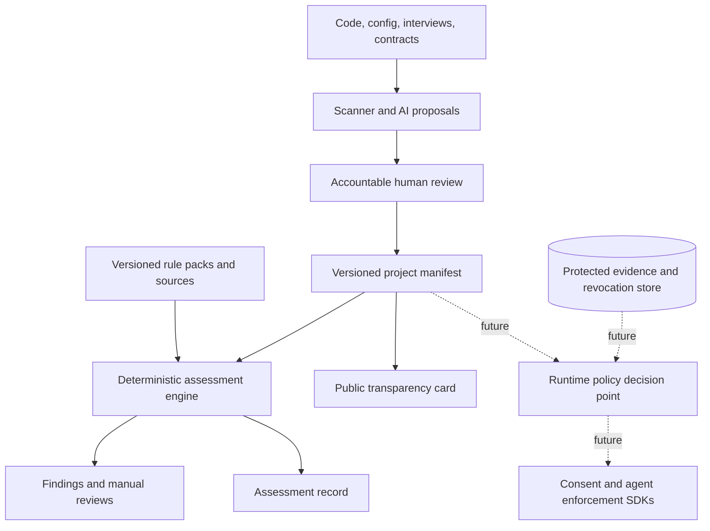

# Architecture

## System shape

The project separates five concerns so a polished UI or an LLM cannot redefine policy behaviour.



## Core objects

| Object | Purpose | Public by default? |
|---|---|---|
| `ProjectManifest` | Reviewed facts about the project, controller/business, activities, notices, rights, AI use, and selected jurisdictions | Redacted fields only |
| `PolicyPack` | Versioned controls, source citations, applicability questions, and implementation logic | Yes |
| `Finding` | A reproducible control outcome with severity, path, explanation, and fix | Usually, without secrets |
| `AssessmentRecord` | Hash of manifest, pack versions, result counts, tool version, and time | Yes |
| `TransparencyCard` | Plain-language public projection of reviewed manifest facts | Yes |
| `EvidenceRecord` | Claim, evidence type, custodian, hash, review date, expiry, and access class | Metadata; raw evidence may be protected |
| `ConsentGrant` | A person's specific, informed, freely given and revocable choice where consent is the basis | No; only aggregate statistics |
| `DelegationGrant` | Authority for an agent to perform scoped actions | No |
| `Decision` | `allow`, `deny`, or `requires_review`, with policy version and reason | Aggregate or redacted |
| `RevocationEvent` | Withdrawal/opt-out plus downstream propagation status | No |

## Current engine

The v0.1 engine deliberately has no network calls and no AI dependency. It:

1. loads JSON without evaluating code;
2. validates the core manifest shape;
3. validates role/applicability declarations and selects rule packs named in `jurisdictions`;
4. runs stable check identifiers;
5. sorts findings for reproducible output;
6. binds manifest, schema, engine, dependency lock, rule-pack and findings digests into an unsigned assessment record.

The readable JSON rule files are the policy catalogue. Check implementations live in code and must be versioned and tested with the catalogue. Future releases should add a constrained policy DSL only after its semantics and denial behaviour are specified.

## Trust and authority

### AI and scanners may

- locate probable data flows and vendors;
- draft manifest fields and explanations;
- cite source files and confidence;
- propose remediations;
- summarise a deterministic result.

### AI and scanners may not

- mark a proposal as an observed fact;
- determine legal applicability without a reviewable basis;
- grant consent or agent authority;
- approve their own changes;
- suppress a blocking finding;
- publish protected evidence;
- turn an absence of evidence into a passing result.

## Consent versus agent delegation

A data subject's consent answers whether specified personal-data processing is permitted where consent is the selected legal basis. A delegation grant answers whether an agent may perform an action for a principal. One does not establish the other. A future action evaluation must satisfy both when both apply:

```text
data-processing permission AND principal delegation AND system policy
```

Every grant needs scope, issuer/subject, policy or notice version, provenance, issue time, expiry where applicable, and revocation state.

## API direction

The future headless interfaces should be small and transport-neutral:

```ts
assessProject(manifest, policyPacks): Assessment
renderTransparency(manifest): TransparencyCard
recordChoice(choice, noticeVersion, context): ConsentReceipt
withdrawChoice(receiptId, scope): RevocationEvent
evaluate(action, subject, context): Decision
```

`evaluate` returns reasons and exact policy versions. It never returns an unexplained numeric score.

## Evidence levels

1. **Declared:** a reviewed statement in the manifest.
2. **Observed:** scanner/runtime observation with provenance.
3. **Tested:** repeatable test result against a control.
4. **Attested:** named accountable reviewer signs a scoped assertion.
5. **Independently assessed:** external reviewer and scope are public.

The level describes evidence strength, not legal compliance.

## Storage and privacy

- Keep public manifests/cards separate from private receipts and evidence blobs.
- Pseudonymise subjects and minimise event attributes; do not store raw prompts by default.
- Encrypt protected stores, separate tenant keys, and restrict support access.
- Make retention and deletion executable for logs, receipts, evidence, and backups.
- Use append-only event semantics for grants and revocations, while supporting data-subject rights and deletion obligations through carefully designed identifiers and cryptographic erasure where appropriate.
- Treat hashes as integrity indicators. A hash neither proves the source was true nor makes personal data anonymous.

## Deployment path

- **Now:** local CLI and CI, manifest in the customer's repository.
- **Next:** optional self-hosted dashboard and static public-card renderer.
- **Later:** protected evidence service, consent/preference SDKs, agent policy decision point, and transparency log.

Self-hosting must remain viable. A hosted service may improve collaboration, but must not be the only way to validate or inspect policy behaviour.
