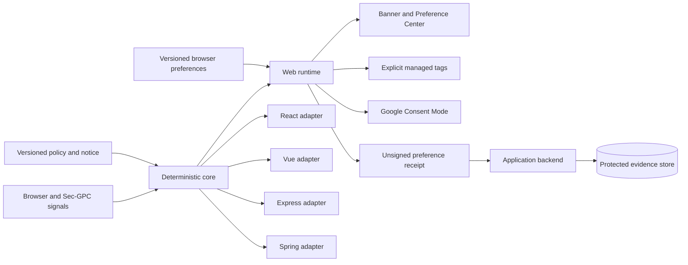
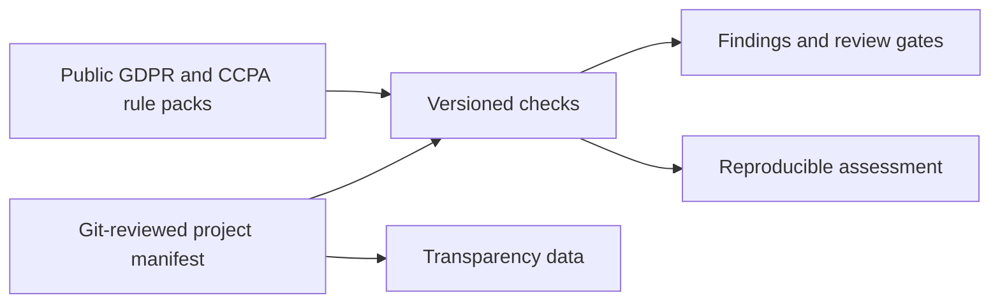

# Architecture

openConsent separates browser presentation, deterministic decisions, integrations, server evidence, and readiness checks. A Banner cannot redefine policy rules, and an unsigned browser receipt cannot become authoritative evidence by itself.

## Runtime shape



The browser starts optional purposes in a denied state. It restores choices only when the stored record is valid for the current project, policy, and notice versions. GPC overrides configured sale/sharing choices. Unknown purpose IDs fail closed.

## Package responsibilities

| Package/module | Owns | Does not own |
| --- | --- | --- |
| `@openconsent/core` | Purpose evaluation, choice state, GPC override, deterministic decisions | DOM, network tags, persistence, authoritative evidence |
| `@openconsent/web` | Banner, Preference Center, browser persistence, managed scripts, Google integrations, unsigned receipt callback | Identity, protected receipt storage, legal applicability |
| `@openconsent/react` | Provider, Banner, gates, hooks | Tags created outside its component tree |
| `@openconsent/vue` | Plugin, Banner, gates, composable | Tags created outside its application lifecycle |
| `@openconsent/express` | Request decisions and server-observed GPC | Authentication, subject mapping, durable store |
| Spring Boot starter | Request filter and server evaluator | Authentication, subject mapping, durable store |
| CLI and rule packs | Privacy Readiness Checks over declared project facts | Runtime discovery, legal certification, consent evidence |

## Managed-tag lifecycle

An optional browser script is inert markup until openConsent grants its purpose:

```html
<script
  type="text/plain"
  data-openconsent-purpose="optional-analytics"
  data-openconsent-src="https://example.com/analytics.js">
</script>
```

The runtime validates the purpose, creates one active script for an allowed choice, and avoids duplicate activation on repeated initialization or repeated grants. Withdrawal removes runtime-owned elements where possible and prevents new managed requests. Browser code cannot recall data already sent during a prior grant, so production integrations also need downstream deletion and retention behavior.

## Google integration order

1. Install the `gtag` command queue.
2. Set Consent Mode storage fields to denied.
3. Wait for the matching openConsent purpose decision.
4. Load and configure the requested Google tag after a grant.
5. Send granted or denied updates when preferences change.

GA4 maps to `optional-analytics`. Google Ads maps to `personalized-ads`. A deployment must not add a second unconditional Google snippet.

## Receipt and trust boundary

The browser can emit an unsigned preference receipt containing project, policy/notice versions, choices, action, and time. Treat every field as untrusted client input.

A production evidence service should:

- authenticate or pseudonymously bind the subject where appropriate;
- validate project and policy versions;
- record a server timestamp and request context with data minimisation;
- use append-only grant/withdrawal events;
- apply access, retention, deletion, backup, and incident controls;
- retry downstream propagation without silently restoring a withdrawn purpose.

Hashes and signatures support integrity and provenance. They do not prove that a choice was informed or that the deployment meets every applicable legal requirement.

## Privacy Readiness Checks

The CLI is a separate deterministic path:



The CLI has no AI dependency. It checks declared facts, produces stable control IDs, and can block CI. A passing declaration check does not prove runtime operating effectiveness.

## AI and scanner boundary

Future scanners may locate probable data flows, cite source files, and propose configuration changes. They may not grant consent, determine legal applicability without review, approve their own findings, suppress blockers, publish protected evidence, or turn missing evidence into a passing result.

## Deployment

- **Current:** npm/browser packages, local or self-hosted configuration, official static website, and repository CLI/CI.
- **Reference next step:** optional self-hosted configuration and protected receipt service with withdrawal webhooks.
- **Later research:** reviewable discovery, standards support, AI-assisted audits, and agent policy decisions separated from user consent.

The public website is a product and demo surface. Detailed events, decision evidence, and integration diagnostics belong in the Playground. Internal progress reports and future capability lists belong in project documentation and changelogs.
